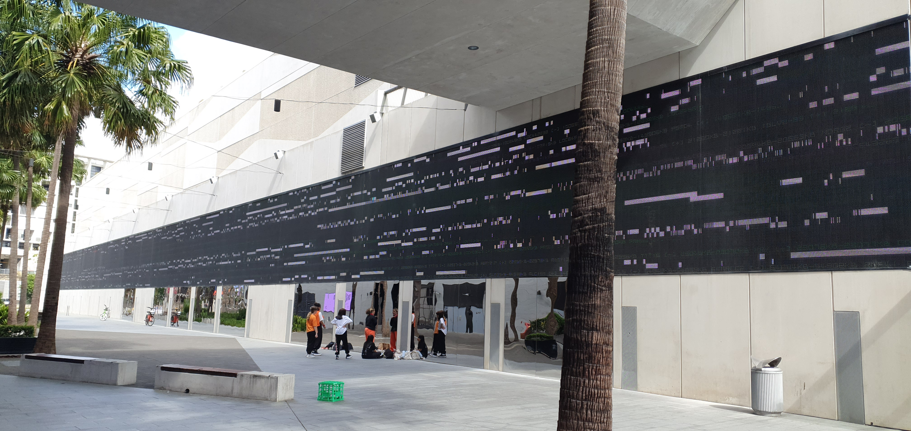
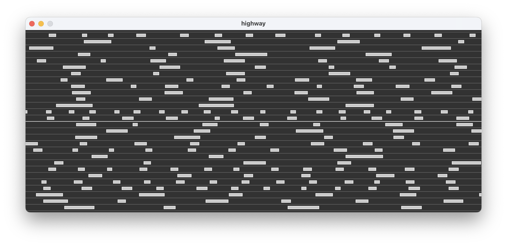

# Highway

Some time ago I visited Sydney, and saw this amazing digital artwork on the side of a museum - basically a simplistic
representation of a highway, with lots of rectangular vehicles travelling at great speed in many lanes.

Loved it. So I built it in [Processing](https://processing.org/).

### the original

### mine

### animated

[Highway](movie/highway.mov)
